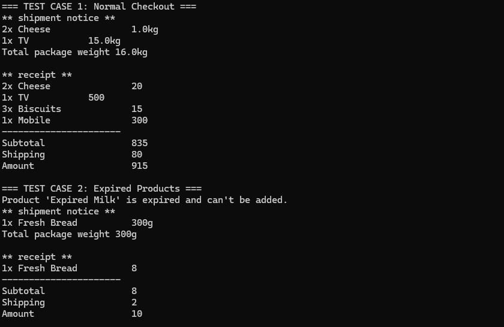

# E-Commerce Cart System
## Project Summary
A C# console application implementing an e-commerce shopping cart system that demonstrates object-oriented design principles. The system manages products with different behaviors (expirable, shippable), handles customer transactions, and processes orders with shipping calculations.
## Test-Cases

## Design Principles Used
### Composition

Products are composed of optional behaviors (IExpirable, IShippable) rather than using inheritance
Allows flexible combinations of product features without complex class hierarchies
Product class contains components for expiration and shipping functionality

### Interface Segregation Principle (ISP)

Small, focused interfaces with single responsibilities:

IExpirable - handles expiration logic
IShippable - handles shipping properties
IShippingService - handles shipping cost calculation

Classes only implement interfaces they actually need

## Requirements to Run

.NET Framework 4.7.2 or higher
Visual Studio 2017 or higher (recommended)
C# 7.0 or higher

### How to Run

1. Open the solution in Visual Studio
2. Build the solution (Ctrl+Shift+B)
3. Run the application (F5)
